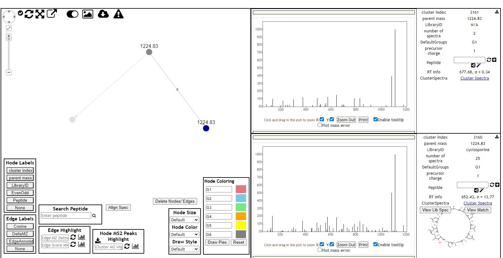

2024-08-22-GNPS Molecular Networking assignment

Tamar Shifroni 028626299

Research Methods B course

In this mass spectrometry tool, I used to explore molecular family as follow.

**Results:** 

<parameter name="spec\_on\_server">f.MSV000088759/peak/     5ugmL\_Opti\_NCE\_stepped20-30-40\_2.mzML;f.MSV000088759/peak/5ugmL\_Opti\_NCE\_stepped20-30-40\_1.mzML;f.MSV000088759/peak/5ugmL\_Opti\_NCE\_stepped20-30-40\_3.mzML;</parameter>

<parameter name="task">fb333b3fd47f40ba9a0a1aeb88263170</parameter>

<parameter name="tolerance.Ion\_tolerance">0.01</parameter>

<parameter name="tolerance.PM\_tolerance">0.01</parameter>

<parameter name="upload\_file\_mapping">spec-00000.mzML|MSV000088759/peak/5ugmL\_Opti\_NCE\_stepped20-30-40\_2.mzML</parameter>

<parameter name="upload\_file\_mapping">spec-00001.mzML|MSV000088759/peak/5ugmL\_Opti\_NCE\_stepped20-30-40\_1.mzML</parameter>

<parameter name="upload\_file\_mapping">spec-00002.mzML|MSV000088759/peak/5ugmL\_Opti\_NCE\_stepped20-30-40\_3.mzML</parameter>

<parameter name="upload\_file\_mapping">lib-00000.mgf|speclibs/CASMI/CASMI.mgf</parameter>

<parameter name="upload\_file\_mapping">lib-00001.mgf|speclibs/GNPS-SCIEX-LIBRARY/GNPS-SCIEX-LIBRARY.mgf</parameter>

<parameter name="upload\_file\_mapping">lib-00002.mgf|speclibs/MONA/MONA.mgf</parameter>

<parameter name="upload\_file\_mapping">lib-00003.mgf|speclibs/GNPS-NIH-CLINICALCOLLECTION2/GNPS-NIH-CLINICALCOLLECTION2.mgf</parameter>

<parameter name="upload\_file\_mapping">lib-00004.mgf|speclibs/GNPS-SELLECKCHEM-FDA-PART1/GNPS-SELLECKCHEM-FDA-PART1.mgf</parameter>

<parameter name="upload\_file\_mapping">lib-00005.mgf|speclibs/GNPS-COLLECTIONS-PESTICIDES-NEGATIVE/GNPS-COLLECTIONS-PESTICIDES-NEGATIVE.mgf</parameter>

<parameter name="upload\_file\_mapping">lib-00006.mgf|speclibs/LDB\_POSITIVE/LDB\_POSITIVE.mgf</parameter>

<parameter name="upload\_file\_mapping">lib-00007.mgf|speclibs/GNPS-NIH-NATURALPRODUCTSLIBRARY/GNPS-NIH-NATURALPRODUCTSLIBRARY.mgf</parameter>

<parameter name="upload\_file\_mapping">lib-00008.mgf|speclibs/GNPS-NIH-CLINICALCOLLECTION1/GNPS-NIH-CLINICALCOLLECTION1.mgf</parameter>

<parameter name="upload\_file\_mapping">lib-00009.mgf|speclibs/BERKELEY-LAB/BERKELEY-LAB.mgf</parameter>

<parameter name="upload\_file\_mapping">lib-00010.mgf|speclibs/MMV\_POSITIVE/MMV\_POSITIVE.mgf</parameter>

<parameter name="upload\_file\_mapping">lib-00011.mgf|speclibs/GNPS-NIH-NATURALPRODUCTSLIBRARY\_ROUND2\_NEGATIVE/GNPS-NIH-NATURALPRODUCTSLIBRARY\_ROUND2\_NEGATIVE.mgf</parameter>

<parameter name="upload\_file\_mapping">lib-00012.mgf|speclibs/GNPS-SELLECKCHEM-FDA-PART2/GNPS-SELLECKCHEM-FDA-PART2.mgf</parameter>

<parameter name="upload\_file\_mapping">lib-00013.mgf|speclibs/PNNL-LIPIDS/PNNL-LIPIDS-NEGATIVE.mgf</parameter>

<parameter name="upload\_file\_mapping">lib-00014.mgf|speclibs/PNNL-LIPIDS/PNNL-LIPIDS-POSITIVE.mgf</parameter>

<parameter name="upload\_file\_mapping">lib-00015.mgf|speclibs/GNPS-NIST14-MATCHES/GNPS-NIST14-MATCHES.mgf</parameter>

<parameter name="upload\_file\_mapping">lib-00016.mgf|speclibs/IQAMDB/IQAMDB.mgf</parameter>

<parameter name="upload\_file\_mapping">lib-00017.mgf|speclibs/GNPS-IOBA-NHC/GNPS-IOBA-NHC.mgf</parameter>

<parameter name="upload\_file\_mapping">lib-00018.mgf|speclibs/GNPS-NIH-SMALLMOLECULEPHARMACOLOGICALLYACTIVE/GNPS-NIH-SMALLMOLECULEPHARMACOLOGICALLYACTIVE.mgf</parameter>

<parameter name="upload\_file\_mapping">lib-00019.mgf|speclibs/BILELIB19/BILELIB19.mgf</parameter>

<parameter name="upload\_file\_mapping">lib-00020.mgf|speclibs/HCE-CELL-LYSATE-LIPIDS/HCE-CELL-LYSATE-LIPIDS.mgf</parameter>

<parameter name="upload\_file\_mapping">lib-00021.mgf|speclibs/GNPS-EMBL-MCF/GNPS-EMBL-MCF.mgf</parameter>

<parameter name="upload\_file\_mapping">lib-00022.mgf|speclibs/GNPS-PRESTWICKPHYTOCHEM/GNPS-PRESTWICKPHYTOCHEM.mgf</parameter>

<parameter name="upload\_file\_mapping">lib-00023.mgf|speclibs/MIADB/MIADB.mgf</parameter>

<parameter name="upload\_file\_mapping">lib-00024.mgf|speclibs/GNPS-COLLECTIONS-PESTICIDES-POSITIVE/GNPS-COLLECTIONS-PESTICIDES-POSITIVE.mgf</parameter>

<parameter name="upload\_file\_mapping">lib-00025.mgf|speclibs/GNPS-MSMLS/GNPS-MSMLS.mgf</parameter>

<parameter name="upload\_file\_mapping">lib-00026.mgf|speclibs/GNPS-FAULKNERLEGACY/GNPS-FAULKNERLEGACY.mgf</parameter>

<parameter name="upload\_file\_mapping">lib-00027.mgf|speclibs/MASSBANKEU/MASSBANKEU.mgf</parameter>

<parameter name="upload\_file\_mapping">lib-00028.mgf|speclibs/LDB\_NEGATIVE/LDB\_NEGATIVE.mgf</parameter>

<parameter name="upload\_file\_mapping">lib-00029.mgf|speclibs/HMDB/HMDB.mgf</parameter>

<parameter name="upload\_file\_mapping">lib-00030.mgf|speclibs/DEREPLICATOR\_IDENTIFIED\_LIBRARY/DEREPLICATOR\_IDENTIFIED\_LIBRARY.mgf</parameter>

<parameter name="upload\_file\_mapping">lib-00031.mgf|speclibs/PSU-MSMLS/PSU-MSMLS.mgf</parameter>

<parameter name="upload\_file\_mapping">lib-00032.mgf|speclibs/BMDMS-NP/BMDMS-NP.mgf</parameter>

<parameter name="upload\_file\_mapping">lib-00033.mgf|speclibs/RESPECT/RESPECT.mgf</parameter>

<parameter name="upload\_file\_mapping">lib-00034.mgf|speclibs/SUMNER/SUMNER.mgf</parameter>

<parameter name="upload\_file\_mapping">lib-00035.mgf|speclibs/GNPS-LIBRARY/GNPS-LIBRARY.mgf</parameter>

<parameter name="upload\_file\_mapping">lib-00036.mgf|speclibs/GNPS-COLLECTIONS-MISC/GNPS-COLLECTIONS-MISC.mgf</parameter>

<parameter name="upload\_file\_mapping">lib-00037.mgf|speclibs/MMV\_NEGATIVE/MMV\_NEGATIVE.mgf</parameter>

<parameter name="upload\_file\_mapping">lib-00038.mgf|speclibs/UM-NPDC/UM-NPDC.mgf</parameter>

<parameter name="upload\_file\_mapping">lib-00039.mgf|speclibs/MASSBANK/MASSBANK.mgf</parameter>

<parameter name="upload\_file\_mapping">lib-00040.mgf|speclibs/GNPS-NIH-NATURALPRODUCTSLIBRARY\_ROUND2\_POSITIVE/GNPS-NIH-NATURALPRODUCTSLIBRARY\_ROUND2\_POSITIVE.mgf</parameter>

<parameter name="user">FMLab</parameter>

<parameter name="uuid">1E494983-1BE8-0001-D253-C5A03E701B70</parameter>

<parameter name="workflow">METABOLOMICS-SNETS-V2</parameter>

